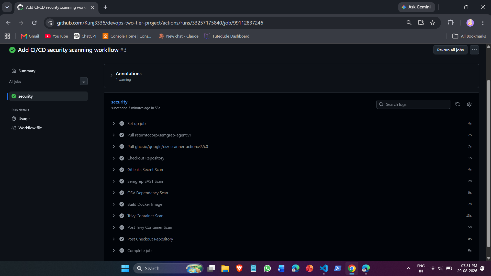
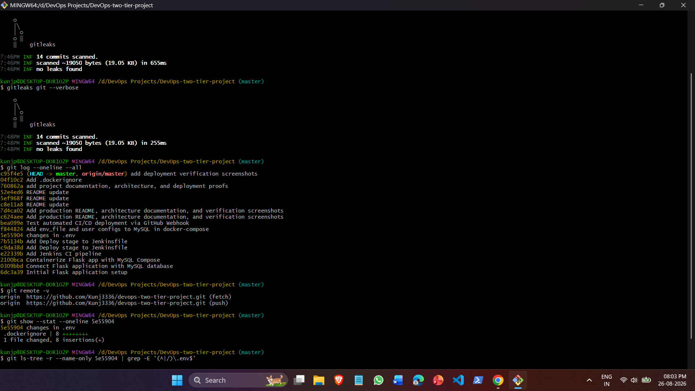
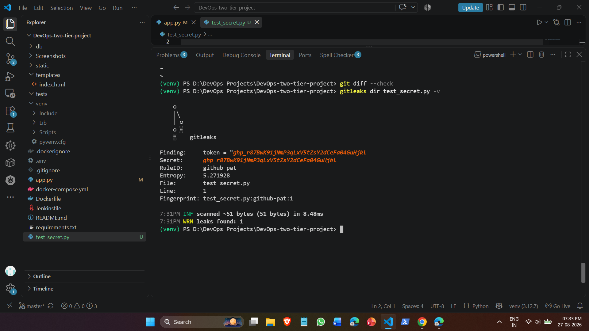
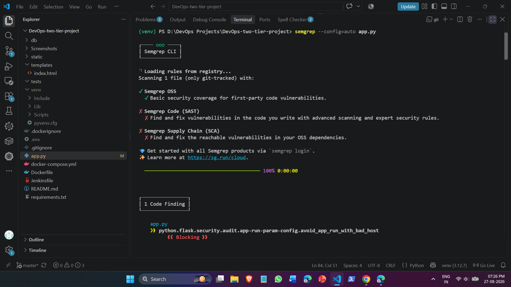
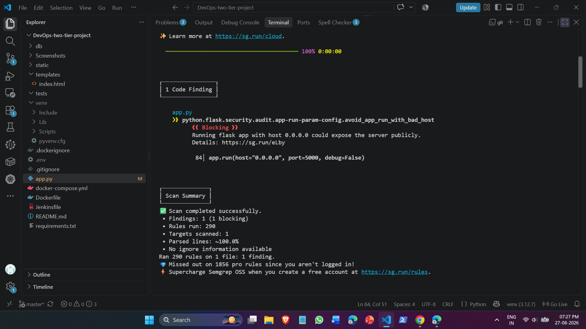
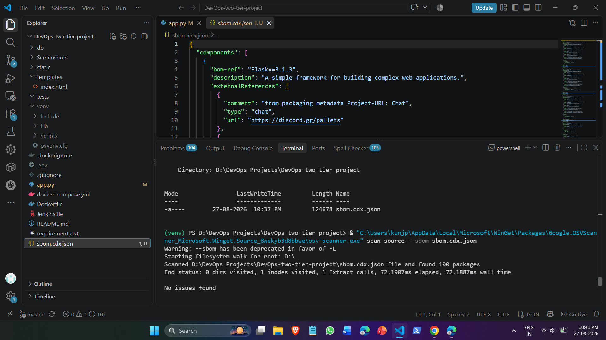
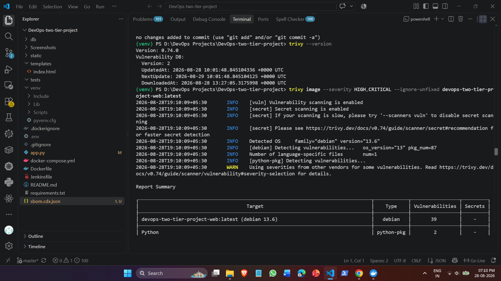
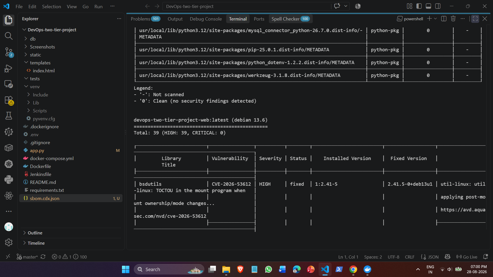

# Automated Security Checks in CI/CD (DevSecOps Pipeline)

A comprehensive implementation and research guide for embedding automated security controls into continuous integration workflows. This project applies "Shift-Left" security principles by scanning for hardcoded secrets, analyzing source code, auditing open-source dependencies, and inspecting container images before deployment.

---

## Target Project & Architecture

This security pipeline was developed, integrated, and verified against the two-tier application repository:
* **Target Application:** [`devops-two-tier-project`](https://github.com/Kunj3336/devops-two-tier-project)
* **Application Stack:** Python (Flask), MySQL, Docker, Docker Compose
* **CI/CD Platform:** GitHub Actions

### Implemented Security Layers

| Security Layer | Tool Selected | Execution Stage | Purpose |
| :--- | :--- | :--- | :--- |
| **Secret Detection** | Gitleaks | Stage 1 (Pre-commit / CI) | Detect hardcoded API keys, tokens, and credentials in git history |
| **SAST** | Semgrep | Stage 2 (Static Analysis) | Static code analysis to catch syntax-level vulnerabilities and insecure coding patterns |
| **SCA** | OSV-Scanner | Stage 3 (Dependency Audit) | Scan direct and transitive dependencies against open-source vulnerability databases |
| **Container Scanning** | Trivy | Stage 4 (Artifact Scanning) | Scan OS packages and language libraries inside built Docker container images |

---

## Pipeline Execution Proof

### Unified GitHub Actions Security Run
The full automated security workflow executing all checks sequentially and passing successfully in GitHub Actions:

---

## Security Scan Results & Proofs

### Layer 1: Secret Detection (Gitleaks)
* **Clean History Scan:** Verifying existing commits do not contain sensitive tokens across git history.

* **Threat Detection Proof:** Catching an injected synthetic GitHub Personal Access Token (PAT) during pre-commit and local validation.

### Layer 2: Static Application Security Testing (Semgrep)
* **Rule Engine Execution:** Loading rules from the Semgrep registry to scan the Flask application source.

* **Vulnerability Catch:** Identifying an insecure network binding (`host="0.0.0.0"`) in `app.py`.

### Layer 3: Software Composition Analysis (OSV-Scanner)
* **SBOM Dependency Scan:** Auditing 100 packages via a CycloneDX Software Bill of Materials (`sbom.cdx.json`) for known CVEs.

### Layer 4: Container Vulnerability Scanning (Trivy)
* **Container Layer Audit:** Summary of vulnerability scan across OS packages and language packages inside `devops-two-tier-project-web:latest`.

* **Vulnerability & CVE Breakdown:** Granular reporting of affected binaries, installed versions, and available fixed versions.

---

## Detailed Guides & Implementation Details

For in-depth tool comparisons (Gitleaks vs. TruffleHog), the complete GitHub Actions workflow YAML, and Standard Operating Procedures (SOPs) for CI failures, refer to the [Security Integration Guide](./SECURITY_INTEGRATION_GUIDE.md).